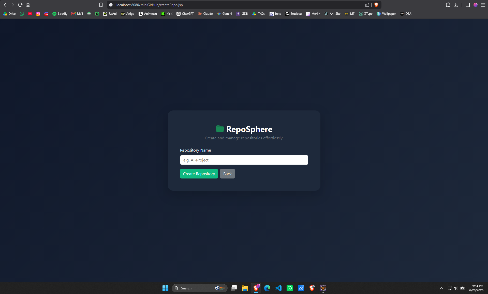
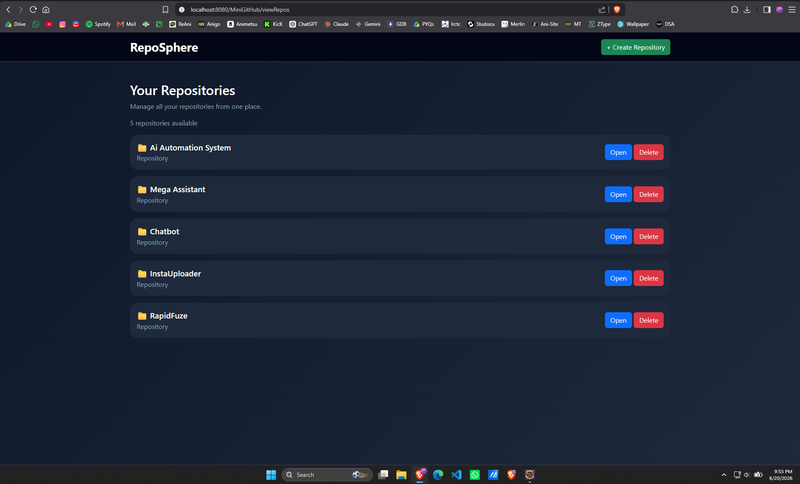
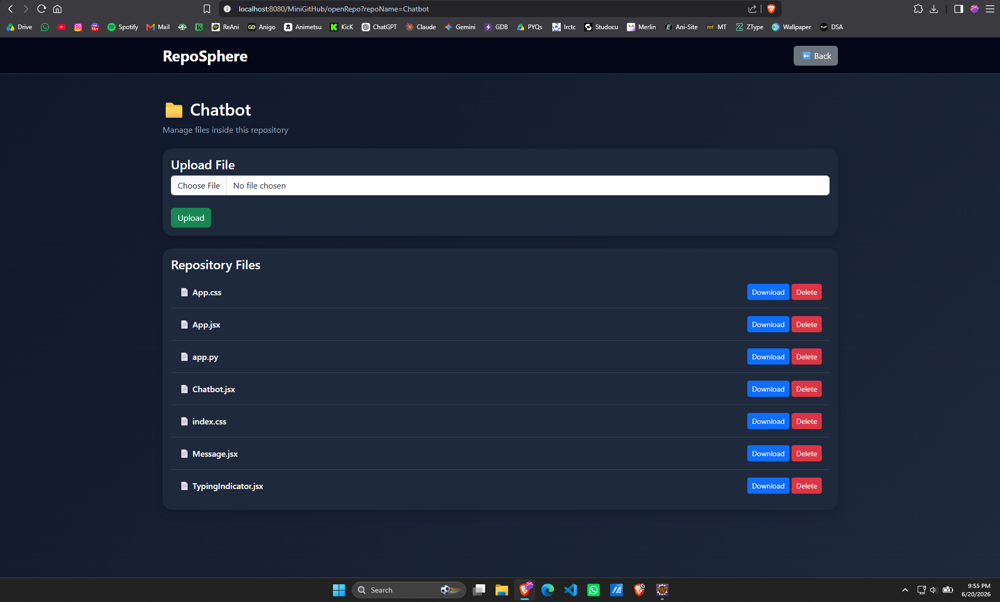

# 🚀 RepoSphere

### A Web-Based Repository Management System

RepoSphere is a web-based repository management platform designed to simplify the organization and management of project files. Inspired by the core concepts of modern repository hosting platforms, RepoSphere allows users to create repositories, upload files, download resources, and manage repository contents through an intuitive and user-friendly interface.

The project was developed using Java Servlets, JSP, JDBC, MySQL, and Apache Tomcat, following a structured web application architecture. It demonstrates key concepts of Java web development, including request handling, database integration, file management, and dynamic content rendering.

RepoSphere provides a centralized environment where users can organize project resources into dedicated repositories, making file management more structured and efficient. The application features a modern Bootstrap-based interface, repository-wise file organization, real-time updates, success notifications, and secure file operations.

This project serves as both a practical repository management solution and a demonstration of full-stack Java web development concepts.

---

## ✨ Features

### 📁 Repository Management

* Create Repository
* View All Repositories
* Open Repository
* Delete Repository

### 📄 File Management

* Upload Files
* Download Files
* Delete Files
* Repository-wise File Organization

### 🎨 User Interface

* Modern Bootstrap-Based Dashboard
* Dark Theme UI
* Repository Cards
* Success Notifications
* Delete Confirmation Dialogs
* Responsive Design

---

## 📸 Screenshots

### Create Repository Page



---

### Repository Dashboard



---

### Repository Files Page



---

## 🛠️ Tech Stack

### Frontend

* JSP (Java Server Pages)
* HTML
* CSS
* Bootstrap 5
* JavaScript

### Backend

* Java Servlets
* JDBC

### Database

* MySQL

### Server

* Apache Tomcat 9

### Development Tools

* Eclipse IDE
* MySQL Workbench
* Git & GitHub

---

## 🏗️ Project Architecture

```text
User
 │
 ▼
JSP Pages
 │
 ▼
Java Servlets
 │
 ▼
JDBC
 │
 ▼
MySQL Database

File Storage
 │
 ▼
Repositories Folder
```

---

## 📂 Project Structure

```text
RepoSphere/
│
├── src/
│   ├── dao/
│   │   └── DBConnection.java
│   │
│   └── servlets/
│       ├── CreateRepoServlet.java
│       ├── ViewRepoServlet.java
│       ├── DeleteRepoServlet.java
│       ├── OpenRepoServlet.java
│       ├── UploadFileServlet.java
│       ├── DownloadFileServlet.java
│       └── DeleteFileServlet.java
│
├── WebContent/
│   ├── createRepo.jsp
│   ├── viewRepos.jsp
│   ├── repo.jsp
│
├── screenshots/
│
└── README.md
```

---

## ⚙️ Database Setup

Create Database:

```sql
CREATE DATABASE reposphere;
USE reposphere;
```

Create Repository Table:

```sql
CREATE TABLE repositories (
    id INT AUTO_INCREMENT PRIMARY KEY,
    name VARCHAR(100) NOT NULL
);
```

---

## 🚀 Installation & Setup

### Clone Repository

```bash
git clone https://github.com/Sahilyadav-07/RepoSphere.git
```

### Import Project

Import the project into Eclipse IDE.

### Configure Database

Update MySQL credentials in:

```java
DBConnection.java
```

### Add MySQL Connector

Add the MySQL JDBC Connector JAR to the project's build path.

### Run Tomcat

Deploy the project on Apache Tomcat 9 and start the server.

### Open Application

```text
http://localhost:8080/MiniGitHub/viewRepos
```

---

## 🔄 User Workflow

```text
Create Repository
        ↓
Open Repository
        ↓
Upload Files
        ↓
View Files
        ↓
Download/Delete Files
```

---

## 🎯 Key Learning Outcomes

* Java Servlets
* JSP Development
* JDBC Integration
* MySQL Database Operations
* File Upload & Download Handling
* MVC-Based Web Application Design
* Git & GitHub Workflow
* Bootstrap UI Development

---

## 🔮 Future Enhancements

* User Authentication & Authorization
* Public & Private Repositories
* Repository Search (in building phase)
* Repository Descriptions
* File Metadata Display
* User Profiles
* Collaboration Features
* Repository Analytics
* Spring Boot Migration
* Cloud Deployment

---

👤 Author
---------
RepoSphere was developed by Sahil Yadav as a Java Web Development project demonstrating repository and file management using Java Servlets, JSP, JDBC, MySQL, and Apache Tomcat.

📝 License
----------
The Voice Assistant Project is licensed under the [MIT License](https://opensource.org/licenses/MIT), allowing for free use, modification, and distribution of the software.
